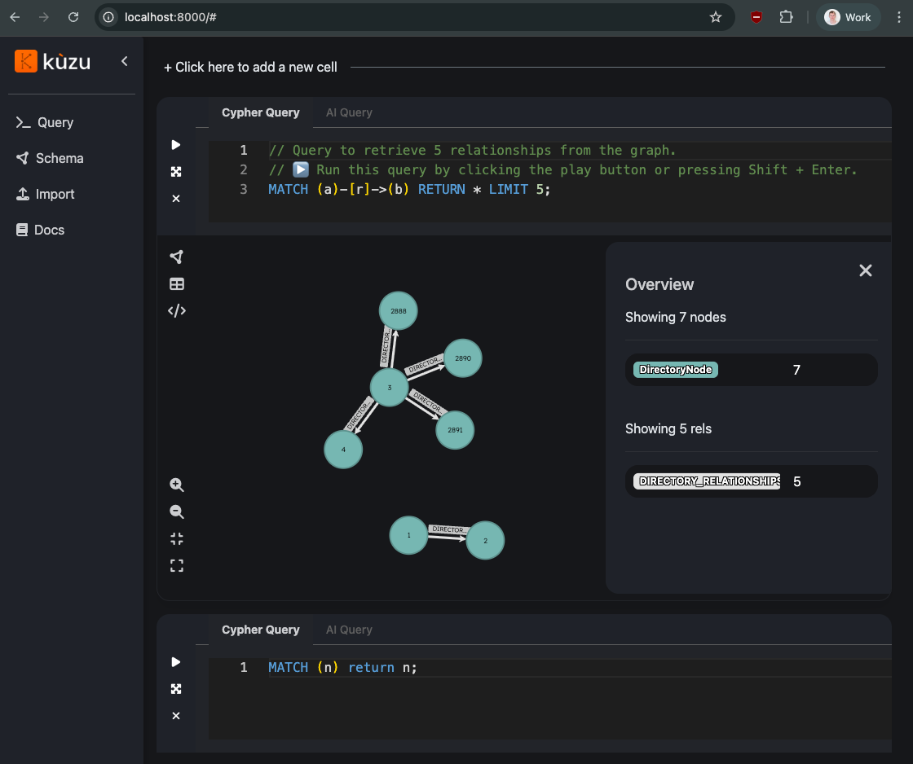

Under some circumstances you may wish to directly access the data stored in the underlying kuzudb database file. This guide will describe methods of accessing it.

## Workspace files

For workspaces that have been indexed, their configuration is stored in `~/.gkg/gkg_manifest.json`. This file contains each indexed workspace and the `data_directory_name`.

An example would be:

```json
{
  "workspace_folders": {
    "user/work/gitlab": {
      "data_directory_name": "3f86676f935f1266",
      "last_indexed_at": "2025-09-17T23:47:37.040320Z",
      "status": "indexed",
      "projects": {
        "user/work/gitlab": {
          "project_hash": "3f86676f935f1266",
          "last_indexed_at": "2025-09-17T23:47:37.040320Z",
          "status": "indexed",
          "error_message": null
        }
      }
    }
  },
  "framework_version": "0.13.0"
}
```

The database file for each project is stored inside of their unique `data_directory_name` such as: `~/.gkg/gkg_workspace_folders/<data_directory_name>/<data_directory_name>/database.kz`. Given the above example, we would have the full path of: `/Users/user/.gkg/gkg_workspace_folders/3f86676f935f1266/3f86676f935f1266/database.kz`.

## KuzuDB explorer

Kuzu provides the [Kuzu Explorer](https://github.com/kuzudb/explorer) docker container that allows you to query and visualize the database files.

Assuming docker has been installed, you can run:

```
docker run -p 8000:8000 -v ~/.gkg/gkg_workspace_folders/<data_directory_name>/<data_directory_name>:/database -e KUZU_FILE=database.kz -i --rm kuzudb/explorer:latest
```

You can now explore the database with your own queries:



## KuzuDB MCP with Claude and Claude Code

You may wish to connect an LLM directly to the database using Kuzu's official [MCP server](https://github.com/kuzudb/kuzu-mcp-server).

### Claude Desktop

On macOS the Claude Desktop configuration file is stored in ~/Library/Application Support/Claude/claude_desktop_config.json.

To connect, use the kuzudb/mcp-server docker image and add this to the mcpServers object:

```json
{
  "mcpServers": {
    "kuzu": {
      "command": "docker",
      "args": [
        "run",
        "-v",
        "{Path to the directory containing Kuzu database file}:/database",
        "-e",
        "KUZU_DB_FILE={Kuzu database file name}",
        "--rm",
        "-i",
        "kuzudb/mcp-server"
      ]
    }
  }
}
```

Change the {Path to the directory containing Kuzu database file} to the actual path
and then restart Claude Desktop.

### Claude Code

To configure claude code, use the mcp add command:

```
claude mcp add kuzudb --scope user -- docker run -v {Path to the directory containing Kuzu database file}:/database -e KUZU_DB_FILE=database.kz -i --rm kuzudb/mcp-server
```

Change the {Path to the directory containing Kuzu database file} to the actual path
and then start `claude`.

## Troubleshooting

Your version of kuzudb/mcp-server or kuzudb/explorer must be greater than or equal to `0.11.2` otherwise you will get an empty database with no errors.

Only one process may open the database at a time, ensure `gkg server` is not running or any other tools that connect to the database (such as MCP services, Claude Desktop or other instances of Kuzu Explorer)
