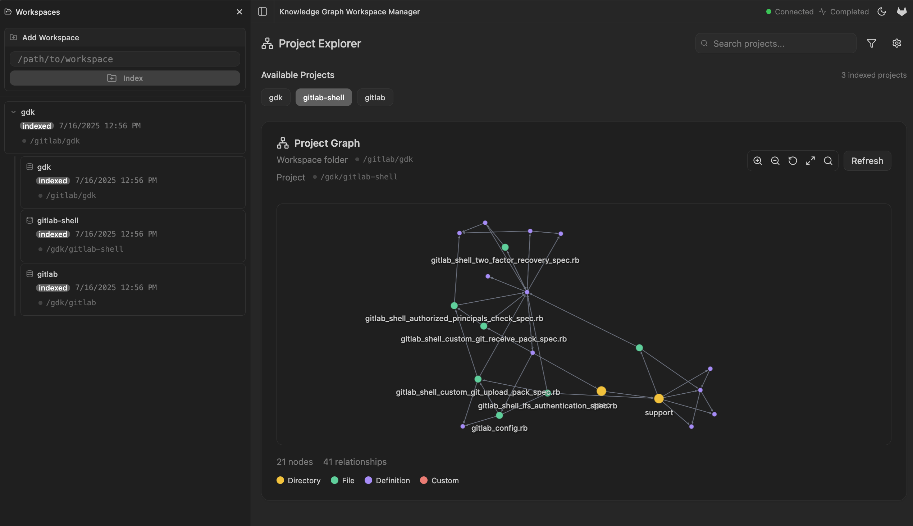

The GitLab Knowledge Graph is a powerful system designed to create a queryable map of your code repositories and tie them to the GitLab SDLC. This structured data provides deep insights into your codebase, paving the way for advanced code analysis and AI-driven features.

## What is it?

At its core, the GitLab Knowledge Graph is a code analysis engine that transforms your repositories into a structured knowledge base. It scans your code to identify:

- **Structural Elements**: Files, directories, classes, functions, and modules that form the backbone of your application.
- **Code Relationships**: Intricate connections like function calls, inheritance hierarchies, and module dependencies.

All of this information is stored in a high-performance graph database called [`Kuzu`](https://kuzudb.com/), allowing you to query and explore your code at scale.

## Common Use Cases

- **RAG (Retrieval-Augmented Generation)**: Use the GitLab Knowledge Graph as a database for your RAG use cases.
- **Architectural Visualization**: Generate insightful diagrams of your system's structure and dependencies.

## Project Status

> **Note**: This project is currently in active development and is not yet ready for production use.

You can follow our progress and contribute to the discussion in the [Knowledge Graph First Iteration epic](https://gitlab.com/groups/gitlab-org/-/epics/17514).

## Next Steps

Ready to dive in? Check out the [Installation](/getting-started/installation) guide to get the GitLab Knowledge Graph up and running on your local machine.
